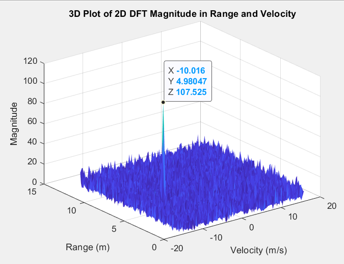

# FMCW Radar Data Processing using 2D DFT for Range-Doppler Analysis

## Overview

This project implements **FMCW (Frequency Modulated Continuous Wave)** radar signal processing using **MATLAB**. The main objective is to demonstrate the efficacy of 2D Discrete Fourier Transform (DFT) for **range and velocity estimation** in radar systems. The project generates radar signals, processes them using DFT techniques, and visualizes the results to enhance target detection capabilities. This approach can be used for automotive radar, weather monitoring, aerospace, and other applications that require precise range and velocity measurements.

## Features

- **FMCW Radar Signal Generation**: Custom MATLAB functions are used to simulate FMCW radar signals and generate ADC data.
- **2D DFT Processing**: Discrete Fourier Transform (DFT) matrices are applied to process radar signals for accurate **range and velocity** estimations.
- **Data Visualization**: Visualization of the 2D DFT results using **meshgrid** and **surf** commands.
- **Simulation Results**: Includes the range and velocity detection along with simulation results for validating the radar's performance.

## Files

```plaintext
FMCW-Radar-Data-Processing/
├── Radar_Sim.m             # Main script for FMCW radar signal simulation and processing
├── adcDataGenerate.m       # Custom function for generating radar ADC data
├── Detection.png           # Visualization of detection results
├── README.md               # Project documentation
```

1. Radar_Sim.m
The main MATLAB script that simulates the FMCW radar system. It processes the radar signals to estimate the range and velocity of the detected target using 2D DFT. This file generates the plots and visualizations to understand the range and Doppler effects.

2. adcDataGenerate.m
A custom MATLAB function that generates simulated ADC data based on defined radar parameters. The data generated is used for further signal processing in the Radar_Sim.m script.

3. Detection.png
A graphical representation of the range and velocity detection results after processing the radar data. It provides insights into the performance of the FMCW radar system.

Results
Detected Range: 4.98 meters
Target Range: 5.0 meters
Error: The detected range is 0.2 meters lesser than the target range.
Detected Velocity: -10.01 m/s
Target Velocity: -10.0 m/s
Error: The detected velocity is -0.1 m/s greater than the target velocity.
## Simulation Results Visualized:


